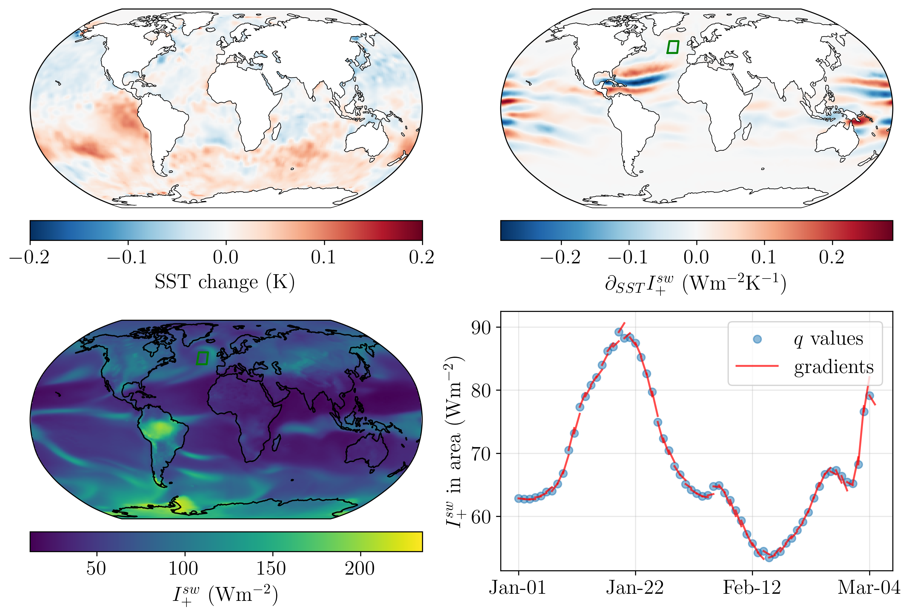

# Sensitivity Analysis for Climate Science with Climate in a Bottle

Accepted at CCAI-NeurIPS25.
## Installation

### Download cBottle weights
First, download the coarse Climate in a Bottle model weights with:
```
curl -L 'https://api.ngc.nvidia.com/v2/models/org/nvidia/team/earth-2/cbottle/1.2/files?redirect=true&path=cBottle-3d/training-state-009856000.checkpoint' -o 'training-state-009856000.checkpoint'
```

In the configs the checkpoint file is referred to as `cBottle-3d.zip` so rename it to that:
```
mv training-state-009856000.checkpoint cBottle-3d.zip
```

### Install dependencies
Activate your virtual environment and then install from `requirements.txt`:
```
pip install -r requirements.txt
```

## Run adjoint sensitivity algorithm
To run on a single GPU using `basic_config.yaml`:

```
python backprop_gradients_amip_sst.py
```

Run on multiple GPUs:
```
torchrun --nproc-per-node=2 backprop_gradients_amip_sst.py
```

### Run grad-check
```
python grad_check --output_folder OUTPUT_FOLDER
```
This produces a plot showing the function q(SST) and its gradients (in the direction of SST changing with time).

